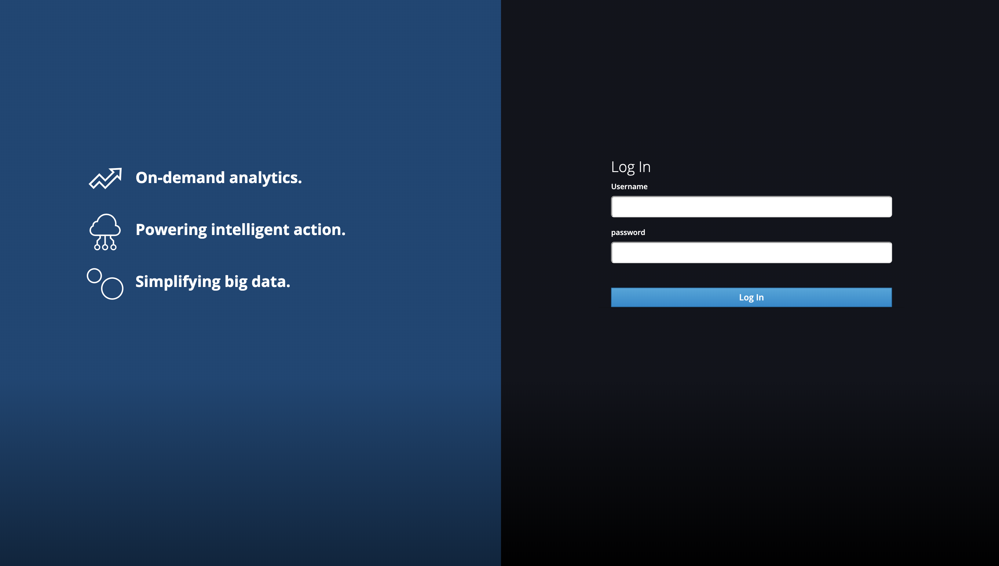

# dl-keycloak-theme
Keycloak theme for DL

### Instructions:

- cp the keycloak theme into a new directory.
- replace all files under the "login" directory in the new theme.
- enable the theme in keycloak.
